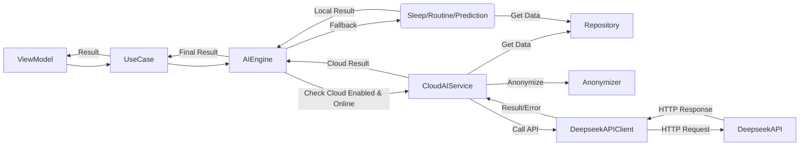

# 寶寶生活記錄專業版（Baby Tracker）- 第三階段：Deepseek API 整合設計

## 1. 背景與目標

根據用戶最新要求，將原定於第六階段的Deepseek API整合提前至第三階段，與本地AI分析功能同步開發。目標是實現一個混合分析模式，允許應用在用戶同意且網絡可用時，利用Deepseek API提供更深入、更準確的AI分析（睡眠模式、作息規律、預測、建議生成），同時在離線或用戶禁用雲端分析時，能夠優雅降級至本地分析功能。

## 2. 整合架構設計

我們將在現有MVVM架構基礎上，引入一個新的 `CloudAIService` 層，負責與Deepseek API交互。AI分析流程將調整為：

1.  **ViewModel** 發起分析請求給 **UseCase**。
2.  **UseCase** 調用 **AIEngine**。
3.  **AIEngine** 首先嘗試調用 **CloudAIService**（如果用戶啟用且網絡可用）。
4.  **CloudAIService** 負責：
    -   檢查用戶設置和網絡狀態。
    -   獲取所需數據（通過Repository）。
    -   **匿名化數據**。
    -   調用 **DeepseekAPIClient** 發送請求。
    -   處理API響應或錯誤。
    -   將結果返回給 **AIEngine**。
5.  如果 **CloudAIService** 調用成功，**AIEngine** 直接使用雲端結果。
6.  如果 **CloudAIService** 調用失敗（用戶禁用、離線、API錯誤），**AIEngine** 降級調用本地分析模組（`SleepPatternAnalyzer`, `RoutineAnalyzer`, `PredictionEngine`）。
7.  **AIEngine** 將最終結果（雲端或本地）返回給 **UseCase**。
8.  **UseCase** 將結果傳遞給 **ViewModel**。

## 3. 核心組件設計

### 3.1 CloudAIService

-   **職責**：作為與雲端AI交互的統一接口，處理網絡、用戶設置、數據匿名化和API調用。
-   **接口**：提供類似於本地分析器的接口，如 `analyzeSleepPatternCloud`, `predictNextSleepCloud`。
-   **實現**：
    -   檢查 `UserSettings` 是否啟用雲端分析。
    -   使用 `NetworkMonitor` 檢查網絡連接。
    -   調用 `DataAnonymizer` 處理數據。
    -   調用 `DeepseekAPIClient`。
    -   處理API錯誤，實現重試機制。
    -   實現結果緩存（可選），減少API調用。

### 3.2 DeepseekAPIClient

-   **職責**：封裝與Deepseek API的HTTP通信細節。
-   **接口**：提供具體的API調用方法，如 `callDeepseekAnalysis(data: AnonymizedData)`。
-   **實現**：
    -   使用 `URLSession` 或 `Alamofire` 進行網絡請求。
    -   處理API Key的 安全存儲和使用（從 `UserSettings` 獲取）。
    -   構建請求體（JSON）。
    -   解析API響應（JSON）。
    -   處理HTTP錯誤和API特定錯誤碼。

### 3.3 DataAnonymizer

-   **職責**：對發送到雲端的數據進行匿名化處理。
-   **接口**：`anonymize(records: [ActivityRecord]) -> AnonymizedData`。
-   **實現**：
    -   移除或替換用戶標識符（如Baby ID）。
    -   對時間戳進行相對化處理（例如，相對於某個基準點）。
    -   移除或模糊化自由文本筆記。
    -   根據需要對數值數據進行分箱或添加噪聲。
    -   確保符合隱私政策。

### 3.4 UserSettings

-   **職責**：存儲用戶關於雲端分析的偏好設置。
-   **屬性**：
    -   `isCloudAnalysisEnabled: Bool`
    -   `deepseekAPIKey: String?` (安全存儲，例如使用 Keychain)
    -   `useCloudAnalysisOnlyOnWiFi: Bool`
-   **實現**：使用 `UserDefaults` 或其他持久化方式。

### 3.5 AIEngine (修改)

-   **職責**：協調本地和雲端分析。
-   **實現**：
    -   修改現有分析方法，增加檢查雲端服務的邏輯。
    -   注入 `CloudAIService` 依賴。
    -   實現優雅降級邏輯。

## 4. 數據模型與API交互

-   **請求數據**：定義 `AnonymizedData` 結構體，包含發送到Deepseek API所需的匿名化數據（如時間序列、活動類型、持續時間等）。
-   **響應數據**：定義與Deepseek API響應對應的數據結構，用於解析返回的分析結果（可能比本地分析結果更豐富）。
-   **API Endpoint**：需要與Deepseek確認具體的API Endpoint和請求/響應格式。

## 5. 用戶界面與交互

-   **設置頁面**：
    -   添加開關以啟用/禁用雲端分析。
    -   提供輸入Deepseek API Key的界面（需要強調安全風險）。
    -   添加選項以限制僅在Wi-Fi下使用雲端分析。
    -   提供隱私政策說明鏈接。
-   **分析結果展示**：
    -   在UI上明確標識結果來源（本地分析或雲端分析）。
    -   雲端分析結果可能包含更詳細的信息或不同的圖表，需要相應調整UI。
-   **錯誤提示**：
    -   提供清晰的錯誤提示，例如網絡錯誤、API Key無效、API調用失敗等。
    -   在雲端分析失敗時，告知用戶正在使用本地分析結果。

## 6. 錯誤處理與降級

-   **網絡錯誤**：`CloudAIService` 捕獲網絡錯誤，通知 `AIEngine` 降級到本地分析。
-   **API錯誤**：`DeepseekAPIClient` 處理API返回的錯誤碼，`CloudAIService` 根據錯誤類型決定是否重試或降級。
-   **無效API Key**：提示用戶檢查API Key設置。
-   **超時**：設置合理的API請求超時時間，超時後降級到本地分析。
-   **降級通知**：在UI上適當提示用戶當前使用的是本地分析結果。

## 7. 測試計劃

-   **單元測試**：測試 `CloudAIService`, `DeepseekAPIClient`, `DataAnonymizer` 的邏輯。
-   **集成測試**：
    -   測試 `AIEngine` 的混合分析和降級邏輯。
    -   測試與Deepseek API的實際交互（使用測試API Key或Mock Server）。
-   **UI測試**：測試用戶設置界面和分析結果展示。
-   **網絡測試**：測試不同網絡條件（Wi-Fi, 移動網絡, 離線）下的表現。
-   **安全測試**：驗證API Key存儲和數據匿名化的安全性。

## 8. 實施步驟

1.  實現 `UserSettings` 和相關設置界面。
2.  實現 `DataAnonymizer`。
3.  實現 `DeepseekAPIClient`（需要用戶提供API Key進行測試）。
4.  實現 `CloudAIService`。
5.  修改 `AIEngine` 以支持混合分析和降級。
6.  修改相關 `UseCase` 和 `ViewModel` 以處理可能的雲端結果。
7.  更新UI以展示雲端/本地標識和更豐富的結果。
8.  進行全面測試。

## 9. 風險與挑戰

-   **API Key管理**：需要安全存儲用戶提供的API Key。
-   **API成本與限制**：需要考慮Deepseek API的調用成本和頻率限制。
-   **API穩定性與延遲**：外部API的穩定性和響應時間可能影響用戶體驗。
-   **數據隱私**：必須嚴格執行數據匿名化，遵守隱私法規。
-   **結果一致性**：本地分析和雲端分析結果可能存在差異，需要向用戶清晰解釋。

**緩解措施**：使用Keychain存儲API Key，實現API調用頻率控制和緩存，設計清晰的錯誤處理和用戶提示，提供詳細的隱私政策說明。
